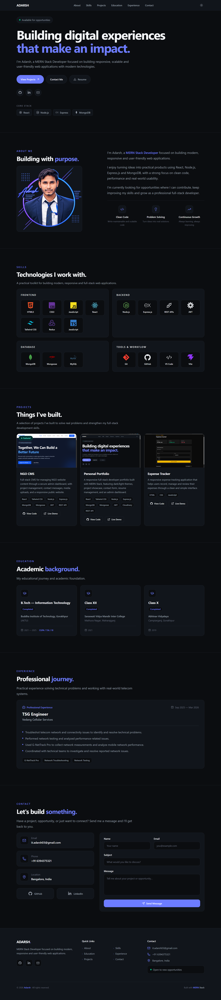
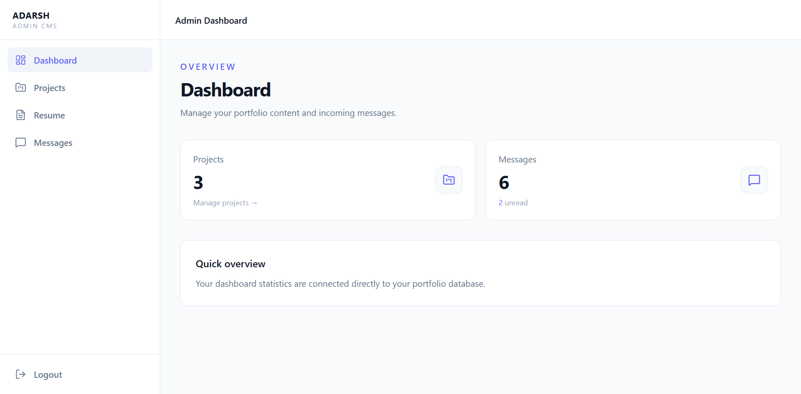

# Adarsh — Full-Stack Developer Portfolio

A responsive full-stack developer portfolio built to showcase my projects, skills, education, experience, and contact information through a clean and professional interface.

The portfolio also includes an admin dashboard for managing projects, messages, and resume content without changing the frontend code.

## ✨ Features

- Responsive design for desktop, tablet, and mobile
- Dark and light theme with saved theme preference
- Project showcase powered by a REST API
- Admin dashboard for project management
- Add, edit, and delete projects
- Project image uploads with Cloudinary
- Contact form with messages stored in MongoDB
- Admin authentication using JWT
- Resume upload and management
- Resume available directly from the public portfolio
- GitHub and LinkedIn integration
- Secure backend configuration using environment variables
- API security with Helmet and rate limiting

## 🛠️ Tech Stack

### Frontend
- React
- Vite
- Tailwind CSS
- React Router
- Lucide React
- React Icons

### Backend
- Node.js
- Express.js
- MongoDB
- Mongoose
- JWT
- bcrypt
- Cloudinary

### Deployment & Services
- Vercel — Frontend
- Render — Backend API
- MongoDB Atlas — Database
- Cloudinary — Media storage

## 📂 Main Sections

- Home
- About
- Education
- Experience
- Skills
- Projects
- Contact

## 🔐 Admin Dashboard

The protected admin dashboard allows authorized users to:

- Log in securely
- Manage projects
- Upload project images
- View contact messages
- Mark messages as read
- Delete messages
- Upload, view, and delete the resume

## 📁 Project Structure

```text
portfolio/
├── public/
├── src/
│   ├── assets/
│   ├── components/
│   ├── sections/
│   ├── admin/
│   ├── App.jsx
│   ├── App.css
│   ├── index.css
│   └── main.jsx
├── server/
│   ├── config/
│   ├── controllers/
│   ├── middleware/
│   ├── models/
│   ├── routes/
│   ├── .env
│   └── server.js
├── .env
├── .gitignore
├── package.json
└── README.md
```

## 🚀 Getting Started

### Clone the repository

```bash
git clone https://github.com/adarsh-node/portfolio.git
cd portfolio
```

### Install dependencies

```bash
npm install
cd server
npm install
cd ..
```

### Frontend environment

Create `.env` in the project root:

```env
VITE_API_URL=http://localhost:5000
```

### Backend environment

Create `.env` inside `server/`:

```env
PORT=5000
MONGO_URI=your_mongodb_connection_string
JWT_SECRET=your_jwt_secret
FRONTEND_URL=http://localhost:5173

CLOUDINARY_CLOUD_NAME=your_cloudinary_cloud_name
CLOUDINARY_API_KEY=your_cloudinary_api_key
CLOUDINARY_API_SECRET=your_cloudinary_api_secret
```

Never commit real credentials or secrets to GitHub.

### Start the backend

```bash
cd server
node server.js
```

### Start the frontend

In another terminal:

```bash
npm run dev
```

Frontend:

```text
http://localhost:5173
```

Backend:

```text
http://localhost:5000
```

## 🔌 API Overview

```text
/api/projects
/api/admin
/api/upload
/api/messages
/api/resume
```

Protected routes require a valid JWT access token.

## ☁️ Deployment

**Frontend:** Vercel  
**Backend:** Render  
**Database:** MongoDB Atlas  
**Media Storage:** Cloudinary

**Live Portfolio:** https://adarsh-techie.vercel.app

**Backend API:** https://adarsh-portfolio-api.onrender.com

## 📸 Screenshots

### Portfolio



### Admin Dashboard



## 🔮 Future Improvements

- Add more portfolio projects
- Expand CMS-managed portfolio content
- Add additional admin features when needed
- Improve analytics and content management capabilities

## 👨‍💻 Author

**Adarsh**

B.Tech — Information Technology

- GitHub: https://github.com/adarsh-node
- LinkedIn: https://www.linkedin.com/in/adarsh-techie/
- Email: it.adarsh03@gmail.com

---

⭐ If you find this project useful or interesting, feel free to explore the repository.
